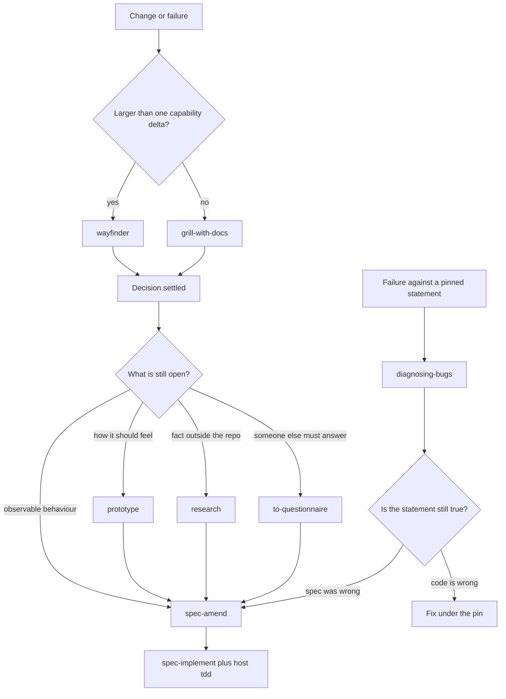

# What sits next to the spec layer

The spec plugin is a truth layer: present-tense capability statements,
content-hash pins, and a plan that is only the delta from the pinned file
to the amended one. Grilling, test-first development, diagnosis, and
architecture surveys stay in the skills a host already runs. Copying those
verbs in here would give the host two specs, two plans, and two seams.

[ORIGIN.md](ORIGIN.md) already refuses to absorb domain-modeling. The same
cut applies to the rest of
[mattpocock/skills](https://github.com/mattpocock/skills) and
[obra/superpowers](https://github.com/obra/superpowers). Those repos own a
process: idea, interview, tickets, code. This repo owns the pin.

Host repos do not get a copy of this file. The injected
[AGENTS.section.md](../substrate/AGENTS.section.md) carries the short rule
an agent session needs. This file is the why, for people reading the plugin.
Same cut as [KNOWLEDGE.md](KNOWLEDGE.md).

Grilling and test-first development are the neighbours already assumed.
`grill-with-docs` stays upstream: it writes `CONTEXT.md` and ADRs, which
spec-amend already knows how to point at from `registry.yaml`.
`spec-implement` already runs each task through a host TDD skill when the
repo has one, and already allows independent plan tasks to run as parallel
subagents confined by `owns`.

## Words that collide

Four words in those repos name a different object than they name here. Use
the local meaning inside `specs/`.

- **Spec.** A capability spec is present-tense implementation truth with
  stable IDs. Matt Pocock's `to-spec` publishes a desired-tense issue:
  problem, user stories, implementation decisions. `docs/product-specs/` is
  the home for that kind of brief. `to-spec`, `to-tickets`, and `implement`
  are a separate pipeline. They do not front spec-amend.
- **Plan.** A spec plan is a delta table in `docs/changes/active/`. A task
  is done when the statements it names have evidence. Superpowers
  `writing-plans` emits bite-sized tasks that include the code, written for
  an implementer with no project context. `writing-plans` and
  `executing-plans` fight the delta.
- **Seam.** A registry seam is an unowned cross-cutting path in
  `specs/registry.yaml`. `codebase-design` uses Michael Feathers' seam: a
  place where behaviour can change without an edit at that place. Say
  "registry seam" and "module seam" when both are in play, or ownership
  gets filed against the wrong one.
- **Backlog.** Here the backlog is the file/pin mismatch. `triage` is an
  issue-tracker state machine. It can label a report. It does not record
  whether the code satisfies a spec.

## Use alongside

These stay installed as their own skills. Each one lands on an object this
system already has.

- **`diagnosing-bugs`**, or Superpowers `systematic-debugging`. Pick one.
  A red loop that shows a pinned statement is false is a code fix and a
  `verified-by` update. It becomes spec-amend only when the statement
  itself is the mistake. This repo grows no diagnosis skill.
- **`code-review`, standards axis only.** spec-review already sends general
  quality to `/code-review`. The other axis of that skill reads an issue,
  or any file under `specs/`, and will treat a capability spec as a feature
  brief. spec-review stays the only spec axis.
- **`prototype` and `research`.** They answer questions reading the code
  cannot. A prototype stays off the main branch; the verdict comes back as
  a statement, or an ADR when the decision is hard to reverse, surprising,
  and a real trade-off. Research writes a cited note, and that file belongs
  in `docs/references/`.
- **`codebase-design` and `improve-codebase-architecture`.** Use them when
  a boundary feels like a layer, or to feed the anomaly list. A deepening
  that does not change observable behaviour gets no statement — the same
  rule as a registry-seam defect. Keep "registry seam" and "module seam"
  apart.
- **`wayfinder`.** For an effort that will not fit in one amendment. Each
  resolved behaviour decision returns as one spec-amend. The map stays on
  the issue tracker. It does not become a second registry.
- **`resolving-merge-conflicts`.** Use the general skill, with three
  constraints that belong to this layer: never reuse or renumber a
  statement ID, never keep the other side's `pinned` hash, and a conflict
  inside a statement is an amendment decision, not a hunk pick.
- **`receiving-code-review`.** For quality comments. A `CONTRADICTS` or
  `DRIFT` finding from spec-review is amend-or-revert.
- **`verification-before-completion`.** The pin rule is already this
  discipline. spec-implement carries the one sentence worth stealing: no
  claim that a task or the pin is done without the command output from
  this turn. The skill itself stays outside.
- **`to-questionnaire`.** Only when the person in the session cannot close
  an open `-U-` uncertainty. The answer comes back through spec-amend.

## Leave outside

- `brainstorming` — grilling again.
- `domain-modeling` — already refused in [ORIGIN.md](ORIGIN.md). Vocabulary
  stays in `CONTEXT.md`; this plugin does not maintain it.
- `ask-matt`, `wizard`, `teach`, `wait-what`.
- `handoff` — the active plan is the handoff.
- `finishing-a-development-branch`, `using-git-worktrees`. The
  regenerability check in a scratch worktree stays the deferred layer-4
  eval in [DESIGN.md](DESIGN.md).
- `subagent-driven-development` as a whole. Its per-task spec check is the
  idea spec-implement already applies, in miniature, to the statements a
  task names. Its "rulings, not stalls" rule tells the agent to decide
  ambiguities and keep going, which contradicts spec-amend's hard stop on
  an open `-U-`. Do not import the ruling ledger.
- `to-spec`, `to-tickets`, `implement`, `writing-plans`, `executing-plans`,
  `triage` — the colliding words above.
